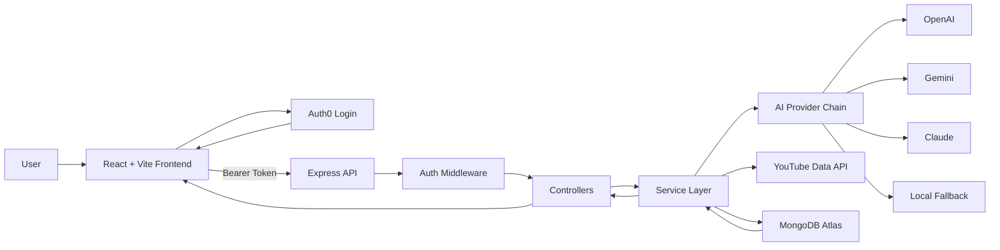

# Text-to-Course Generator

An authenticated full-stack learning platform that turns a topic into a structured course, saves it per user, enriches lessons on demand, and renders rich learning blocks such as explanations, code, MCQs, video recommendations, and downloadable PDFs.

## Problem Statement

Learning a new topic often starts with scattered resources, inconsistent explanations, and no clear sequence. A learner may search for videos, notes, examples, and quizzes separately, then still have to organize everything into a coherent path.

Text-to-Course Generator solves this by letting a user enter a topic and receive a structured course with modules and lessons. The system then enriches each lesson on demand, reducing initial generation time while still producing detailed content when the learner actually opens a lesson.

## Key Features

- Auth0 login and logout
- User-specific saved courses
- Ownership-protected course and lesson access
- AI course outline generation with provider fallback
- AI lesson enrichment with provider fallback
- Local template fallback when AI providers are unavailable
- Lesson content blocks for headings, paragraphs, code, MCQs, and videos
- YouTube video lookup for video blocks
- PDF export for lesson pages
- MongoDB persistence for courses, modules, and lessons

## Tech Stack

- Frontend: React, Vite, React Router, Auth0 React SDK
- Backend: Node.js, Express, Mongoose
- Database: MongoDB Atlas
- Auth: Auth0 JWT verification
- AI Providers: OpenAI, Gemini, Claude, local fallback
- External APIs: YouTube Data API
- PDF Export: `html2canvas`, `jspdf`

## System Design

The app uses a layered architecture:

- Frontend pages handle user interaction, routing, and auth state.
- API utilities centralize backend requests and attach Auth0 access tokens.
- Express routes map HTTP endpoints to controllers.
- Controllers validate request flow and pass authenticated user identity into services.
- Services handle business logic, AI fallback chains, database writes, ownership checks, and YouTube search.
- MongoDB stores normalized course, module, and lesson documents.



## Data Model

The main ownership and content hierarchy is:

```text
Course
  -> Module
      -> Lesson
```

### Course

Stores the generated course metadata:

- `title`
- `description`
- `creator`
- `tags`
- `modules`

### Module

Stores a course section:

- `title`
- `course`
- `lessons`

### Lesson

Stores lesson content and enrichment state:

- `title`
- `module`
- `objectives`
- `content`
- `videoQuery`
- `isEnriched`

## Main Modules

### Frontend

- `client/src/pages/Home.jsx`: login-aware course generation and user-specific course list
- `client/src/pages/Course.jsx`: protected course detail page with modules and lesson links
- `client/src/pages/Lesson.jsx`: protected lesson page with on-demand enrichment and PDF export
- `client/src/components/LessonRenderer.jsx`: routes lesson blocks to block components
- `client/src/blocks`: renders heading, paragraph, code, MCQ, and video blocks
- `client/src/utils/api.js`: central API helper for backend calls

### Backend

- `server/server.js`: Express app setup, CORS, routes, DB startup, error middleware
- `server/routes`: course and lesson route definitions
- `server/controllers`: request/response handlers
- `server/services/ai.service.js`: course generation, lesson enrichment, AI fallback chain, ownership-aware DB logic
- `server/services/youtube.service.js`: YouTube video search
- `server/middlewares/auth.middleware.js`: Auth0 JWT verification
- `server/middlewares/validate.middleware.js`: Mongo ObjectId validation
- `server/models`: Mongoose schemas for course, module, and lesson

## AI Fallback Strategy

Course generation and lesson enrichment use this provider order:

```text
OpenAI -> Gemini -> Claude -> Local fallback
```

This keeps the app usable even when one provider has quota issues, billing limitations, temporary outages, or missing credentials.

The API response for course generation includes:

```json
{
  "providerUsed": "openai"
}
```

Possible values:

- `openai`
- `gemini`
- `claude`
- `fallback`

## Authentication and Authorization

Auth0 is used for login and token-based backend protection.

Protected routes require:

```http
Authorization: Bearer <access_token>
```

The backend reads the Auth0 `sub` claim and stores it as the course `creator`. Course and lesson access are ownership-protected:

```text
Lesson -> Module -> Course -> Creator
```

If a lesson or course does not belong to the current user, the API returns `404` to avoid leaking resource existence.

## Project Structure

```text
text-to-course/
  client/
    src/
      blocks/
      components/
      pages/
      utils/
  server/
    config/
    controllers/
    middlewares/
    models/
    routes/
    services/
```

## Environment Variables

Use the included example files:

- `client/.env.example`
- `server/.env.example`

### Client

```env
VITE_API_BASE_URL=http://localhost:5001/api
VITE_AUTH0_DOMAIN=your-auth0-domain
VITE_AUTH0_CLIENT_ID=your-auth0-client-id
VITE_AUTH0_AUDIENCE=https://text-to-course-api
```

### Server

```env
PORT=5001
MONGO_URL=your-mongodb-connection-string
CLIENT_URL=http://localhost:5173
YOUTUBE_API_KEY=your-youtube-api-key
AUTH0_ISSUER=https://your-auth0-domain/
AUTH0_AUDIENCE=https://text-to-course-api
OPENAI_API_KEY=your-openai-api-key
GEMINI_API_KEY=your-gemini-api-key
CLAUDE_API_KEY=your-claude-api-key
```

## Local Setup

### 1. Clone the repository

```bash
git clone https://github.com/Nishkarsh0Sharma/text-to-course-generator.git
cd text-to-course-generator
```

### 2. Install frontend dependencies

```bash
cd client
npm install
```

### 3. Install backend dependencies

```bash
cd ../server
npm install
```

### 4. Configure environment files

Create:

- `client/.env`
- `server/.env`

Use the examples listed above.

### 5. Start the backend

From the project root:

```bash
cd server
npm run dev
```

Backend runs on:

```text
http://localhost:5001
```

### 6. Start the frontend

Open a second terminal from the project root:

```bash
cd client
npm run dev
```

Frontend runs on:

```text
http://localhost:5173
```

## API Reference

All protected endpoints require:

```http
Authorization: Bearer <access_token>
```

### Health Check

```http
GET /
```

Example response:

```json
{
  "success": true,
  "message": "Text-to-Course backend is running!"
}
```

### Generate Course

```http
POST /api/courses/generate-course
Content-Type: application/json
Authorization: Bearer <access_token>
```

Request body:

```json
{
  "topic": "Machine Learning"
}
```

Example response:

```json
{
  "success": true,
  "message": "Course generated successfully",
  "data": {
    "_id": "course_id",
    "title": "Introduction to Machine Learning",
    "description": "A beginner-friendly course...",
    "tags": ["machine learning", "ai", "beginner"],
    "providerUsed": "gemini",
    "modules": [
      {
        "_id": "module_id",
        "title": "Foundations",
        "lessons": [
          {
            "_id": "lesson_id",
            "title": "What is Machine Learning?"
          }
        ]
      }
    ]
  }
}
```

### Get Current User Courses

```http
GET /api/courses
Authorization: Bearer <access_token>
```

Example response:

```json
{
  "success": true,
  "message": "Courses fetched successfully",
  "data": [
    {
      "_id": "course_id",
      "title": "Course on Machine Learning",
      "description": "A structured learning path...",
      "tags": ["machine learning", "beginner-friendly"],
      "modulesCount": 3
    }
  ]
}
```

### Get Course Details

```http
GET /api/courses/:courseId
Authorization: Bearer <access_token>
```

Example:

```http
GET /api/courses/67f1234567890abcdef12345
```

### Get Lesson Details

```http
GET /api/lessons/:lessonId
Authorization: Bearer <access_token>
```

Example:

```http
GET /api/lessons/67f1234567890abcdef12345
```

### Generate Lesson Content

```http
POST /api/lessons/:lessonId/generate
Authorization: Bearer <access_token>
```

Example response:

```json
{
  "success": true,
  "message": "Lesson content generated successfully",
  "data": {
    "_id": "lesson_id",
    "title": "What is Machine Learning?",
    "objectives": [
      "Understand the core idea",
      "Identify practical importance",
      "Apply the concept at a beginner level"
    ],
    "content": [
      {
        "type": "heading",
        "text": "What is Machine Learning?"
      },
      {
        "type": "paragraph",
        "text": "Machine learning is..."
      },
      {
        "type": "mcq",
        "question": "What best describes machine learning?",
        "options": ["A field of AI", "A database", "A CSS framework"],
        "answer": 0,
        "explanation": "Machine learning is a field of AI..."
      }
    ],
    "videoQuery": "machine learning tutorial for beginners",
    "isEnriched": true
  }
}
```

### Search Lesson Video

```http
GET /api/lessons/video-search/query?query=machine%20learning%20tutorial
```

Example response:

```json
{
  "success": true,
  "message": "Video fetched successfully.",
  "data": {
    "videoId": "youtube_video_id",
    "title": "Machine Learning Tutorial for Beginners"
  }
}
```

## Example `curl` Requests

Generate a course:

```bash
curl -X POST "http://localhost:5001/api/courses/generate-course" \
  -H "Content-Type: application/json" \
  -H "Authorization: Bearer YOUR_ACCESS_TOKEN" \
  -d '{"topic":"React"}'
```

Fetch current user courses:

```bash
curl "http://localhost:5001/api/courses" \
  -H "Authorization: Bearer YOUR_ACCESS_TOKEN"
```

Generate lesson content:

```bash
curl -X POST "http://localhost:5001/api/lessons/YOUR_LESSON_ID/generate" \
  -H "Authorization: Bearer YOUR_ACCESS_TOKEN"
```

## Deployment Notes

Recommended setup:

- Frontend: Vercel
- Backend: Render or Railway
- Database: MongoDB Atlas

For production:

- Set `VITE_API_BASE_URL` to your deployed backend API URL.
- Set `CLIENT_URL` on the backend to your deployed frontend URL.
- Add the deployed frontend URL to Auth0 Allowed Callback URLs, Logout URLs, and Web Origins.
- Keep AI and YouTube keys only in backend environment variables.

## Current MVP Flow

1. User logs in with Auth0.
2. User enters a topic and generates a course.
3. Backend creates a user-owned course.
4. User sees only their saved courses.
5. User opens a course and selects a lesson.
6. Backend enriches the lesson on demand if needed.
7. Frontend renders rich lesson blocks.
8. User can watch a recommended video or download the lesson as PDF.

## License

This project is currently for learning and portfolio use. Add a formal license before wider distribution.
